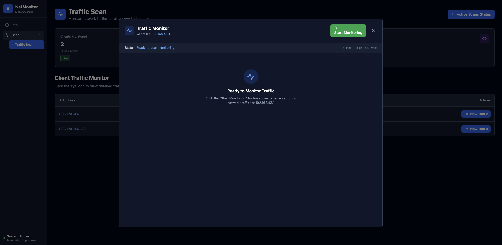

# NetWatcher 🌐

**NetWatcher** adalah aplikasi monitoring jaringan berbasis web yang memungkinkan Anda untuk memantau perangkat yang terhubung ke jaringan dan menganalisis traffic jaringan secara real-time.

## 📋 Daftar Isi

- [Fitur Utama](#-fitur-utama)
- [Teknologi](#-teknologi)
- [Persyaratan Sistem](#-persyaratan-sistem)
- [Instalasi](#-instalasi)
- [Cara Penggunaan](#-cara-penggunaan)
- [Struktur Project](#-struktur-project)
- [API Documentation](#-api-documentation)
- [Troubleshooting](#-troubleshooting)
- [Screenshots](#-screenshots)
- [Kontribusi](#-kontribusi)
- [License](#-license)

## ✨ Fitur Utama

### 1. **Network Scanning**
- 🔍 Scan perangkat di jaringan lokal menggunakan berbagai protokol
- 📊 Deteksi IP Address dan Active Interface
- 🎯 Mendukung multiple scanning modules:
  - **ICMP (Ping)** - Scan cepat menggunakan ping
  - **ARP** - Scan menggunakan ARP protocol (memerlukan root/admin)
  - **TCP SYN** - Port scanning dengan SYN packets

### 2. **Traffic Monitoring**
- 📡 Real-time packet capture dan analisis
- 🎛️ Start/Stop monitoring on-demand
- 📈 Visualisasi traffic dengan detail:
  - Source & Destination IP
  - Protocol (TCP/UDP/ICMP)
  - Port information
  - Packet length
- 🔄 WebSocket untuk update real-time
- 💾 Auto-save ke PCAP dan JSONL format (soon)

### 3. **Active Scans Management**
- 📋 Monitor semua active scans dalam satu dashboard
- 🛑 Stop individual atau bulk stop semua scans
- 🔄 Auto-refresh status setiap 5 detik
- 📊 Thread status monitoring (soon)

## 🛠 Teknologi

### Backend
- **Python 3.8+**
- **Flask** - Web framework
- **Flask-SocketIO** - WebSocket support
- **Scapy** - Network packet manipulation
- **python-nmap** - Network scanning
- **UUID** - Job ID generation

### Frontend
- **React 18+**
- **Vite** - Build tool
- **TailwindCSS** - Styling
- **Axios** - HTTP client
- **Socket.IO Client** - WebSocket client
- **Lucide React** - Icons

## 📦 Persyaratan Sistem

### Minimum Requirements
- **OS**: Linux (Ubuntu 20.04+, Debian 11+) atau macOS
- **Python**: 3.8 atau lebih tinggi
- **Node.js**: 16.x atau lebih tinggi
- **RAM**: 2GB minimum
- **Disk**: 500MB free space

### Dependencies
```bash
# System packages (Ubuntu/Debian)
sudo apt-get update
sudo apt-get install python3-pip python3-venv nodejs npm nmap libpcap-dev

# macOS (menggunakan Homebrew)
brew install python node nmap libpcap
```

### Permissions
⚠️ **Beberapa fitur memerlukan privilese root/administrator:**
- ARP scanning
- Packet capture (traffic monitoring)
- Raw socket operations

## 🚀 Instalasi

### 1. Clone Repository

```bash
git clone https://github.com/shinigami641/net-watcher.git
cd net-watcher
```

### 2. Setup Backend

```bash
# Buat virtual environment
python3 -m venv venv

# Aktivasi virtual environment
# Linux/macOS:
source venv/bin/activate
# Windows:
# venv\Scripts\activate

# Install dependencies
pip install -r requirements.txt
```

**requirements.txt:**
```txt
Flask>=2.2
Flask-SQLAlchemy>=3.0
Flask-SocketIO>=5.3
eventlet
scapy>=2.4.5
python-dotenv
netifaces>=0.11
Flask-Migrate>=4.0
psutil
flask-cors
getmac
```

### 3. Setup Frontend

```bash
# Masuk ke direktori frontend
cd web

# Install dependencies
npm install
```

### 4. Konfigurasi

#### Backend Configuration (`backend/config/api.py`)

```python
# API Configuration
API_HOST = "127.0.0.1"
API_PORT = 4000
DEBUG = True

# CORS Configuration
CORS_ORIGINS still use *
```

#### Frontend Configuration (`frontend/src/config/api.js`)

```javascript
const BASE_URL = 'http://localhost:4000/api';
export const WS_URL = 'http://127.0.0.1:4000/notifications';
```

## 🎮 Cara Penggunaan

### 1. Jalankan Backend

```bash
# Aktivasi virtual environment (jika belum)
source venv/bin/activate

# Jalankan server (MEMERLUKAN ROOT untuk beberapa fitur)
sudo venv/bin/python app.py

# Atau jalankan tanpa root (fitur terbatas)
python app.py
```

Backend akan berjalan di: `http://localhost:4000`

### 2. Jalankan Frontend

```bash
# Buka terminal baru
cd web

# Jalankan development server
npm run dev
```

Frontend akan berjalan di: `http://localhost:5173`

### 3. Akses Aplikasi

Buka browser dan akses: **http://localhost:5173**

## 📖 Cara Menggunakan Fitur

### A. Network Scanning

1. **Pilih Menu "Scan"** di sidebar
2. **Pilih Interface** jaringan yang aktif
3. **Pilih Scanning Module**: [sekarang statis menggunakan ICMP]
   - **ICMP (Ping)**: Scan cepat, tidak perlu root
   - **ARP**: Lebih akurat, memerlukan root
   - **TCP SYN**: Port scanning, memerlukan root
4. **Klik "Start Scan"**
5. Tunggu hasil scan muncul dalam tabel

**Tips:**
- Gunakan ICMP untuk scan cepat
- Gunakan ARP untuk hasil lebih akurat
- ARP scan hanya mendeteksi perangkat di subnet yang sama

### B. Traffic Monitoring

1. **Pilih Menu "Traffic Scan"** di sidebar
2. **Klik "View Traffic"** pada IP yang ingin dimonitor
3. **Modal akan muncul** dengan button Start/Stop
4. **Klik "Start Monitoring"** untuk mulai capture
5. **Data packet akan muncul real-time** di tabel
6. **Klik "Stop Monitoring"** untuk menghentikan
7. **Klik "Clear Data"** untuk membersihkan data (hanya saat monitoring stopped)

**Fitur Traffic Modal:**
- ✅ Real-time packet capture
- ✅ Auto-scroll dengan data terbaru di atas
- ✅ Tampilan detail: Source, Destination, Protocol, Port, Length
- ✅ Export otomatis ke PCAP dan JSONL
- ✅ Raw data view untuk debugging

### C. Active Scans Management

1. **Klik "Active Scans Status"** di halaman Traffic Scan
2. **Modal menampilkan** semua active scans
3. **Fitur yang tersedia**:
   - **Refresh**: Update status manual
   - **Stop**: Stop individual scan
   - **Stop All**: Stop semua scans sekaligus
4. **Auto-refresh** setiap 5 detik

## 📁 Struktur Project

```
netwatcher/
├── netwacher/
│   ├── app.py                      
│   ├── config.py                      
│   ├── requirements.txt            
│   ├── socket_handlers.py            
│   ├── exstension.py            
│   ├── config/
│   │   └── api.py                  
│   ├── controllers/
│   │   └── client_controller.py           
│   │   └── traffic_controller.py           
│   ├── views/
│   │   └── api.py     
│   ├── models/
│   │   └── client.py               
│   ├── services/
│   │   └── alerts.py               
│   ├── thirdparty/
│   │   ├── scapy_a.py #scan traffict
│   │   ├── scapy.py  #scapy file solo running
│   │   ├── fallback.py 
│   │   ├── icmp.py              
│   │   ├── netifaces.py 
│   └── utils/
│       └── api_response.py      
│
├── frontend/
│   ├── src/
│   │   ├── components/
│   │   │   ├── TrafficModal.jsx    # Traffic monitoring modal
│   │   │   ├── TrafficStatusModal.jsx  # Active scans modal
│   │   │   └── ui/                 # UI components
│   │   ├── pages/
│   │   │   ├── ScanPage.jsx        # Network scan page
│   │   │   └── TrafficScanPage.jsx # Traffic scan page
│   │   ├── config/
│   │   │   └── api.js              # API configuration
│   │   └── App.jsx                 # Main app component
│   ├── package.json
│   └── vite.config.js
│
└── README.md
```

## 🔌 API Documentation

### Base URL
```
http://localhost:4000/api
```

### Endpoints

#### 1. Get Active Network Interfaces
```http
GET /active-interface
```

**Response:**
```json
{
    "data": "utun6",
    "message": "Interface Found",
    "status": 1,
    "timestamp": "2025-10-24T14:23:55.862332Z"
}
```

#### 2. Get Ip Addr
```http
GET /ip-addr
```

**Response:**
```json
{
    "data": "172.16.9.1",
    "message": "Ip Found",
    "status": 1,
    "timestamp": "2025-10-24T14:24:24.329280Z"
}
```

#### 3. Scan Network
```http
POST /scan-ip
Content-Type: application/json

{
    "module_name": "icmp"
}
```

**Response:**
```json
{
    "data": [
        {
            "ip": "192.168.43.1",
            "mac": "12:20:78:94:8a:ee"
        },
        {
            "ip": "192.168.43.122",
            "mac": "f6:c8:9f:86:bc:d3"
        }
    ],
    "message": "Scan Success",
    "status": 1,
    "timestamp": "2025-10-24T14:25:14.605044Z"
}
```

#### 4. Start Traffic Monitoring
```http
POST /traffict
Content-Type: application/json

{
  "ip": "192.168.1.10",
  "client_id": "client_abc123"
}
```

**Response:**
```json
{
    "data": "Success",
    "message": "Scan Success",
    "status": 1,
    "timestamp": "2025-10-22T03:14:42.956177Z"
}
```

#### 5. Stop Traffic Monitoring
```http
POST /traffict-stop
Content-Type: application/json

{
  "client_id": "client_abc123"
}
```

#### 6. Get Active Scans Status
```http
GET /traffict-status
```

**Response:**
```json
{
  "status": 1,
  "data": {
    "active_scans": [
      {
        "job_id": "550e8400-e29b-41d4-a716-446655440000",
        "client_id": "client_abc123",
        "ip": "192.168.1.10",
        "thread_alive": true
      }
    ],
    "count": 1
  }
}
```

#### 7. Stop All Active Scans
```http
POST /traffict-stop-all
```

### WebSocket Events

#### Server → Client

**Event: `scan_status`**
```json
{
  "status": "Monitoring active",
  "job": "550e8400-e29b-41d4-a716-446655440000",
  "summary": {
    "ts": "2024-01-15T10:30:00Z",
    "src": "192.168.1.10",
    "dst": "8.8.8.8",
    "l4": "TCP",
    "sport": 54321,
    "dport": 443
  }
}
```

**Event: `scan_stopped`**
```json
{
  "job": "550e8400-e29b-41d4-a716-446655440000",
  "reason": "user_request"
}
```

#### Client → Server

**Event: `join_room`**
```json
{
  "room": "client_abc123"
}
```

## 🐛 Troubleshooting

### Problem: Permission Denied saat Traffic Monitoring

**Solusi:**
```bash
# Jalankan backend dengan sudo
sudo venv/bin/python app.py
```

### Problem: WebSocket tidak connect

**Solusi:**
1. Pastikan backend sudah running
2. Check CORS configuration
3. Verify WebSocket URL di frontend config
4. Check firewall settings

### Problem: ARP Scan tidak menemukan device

**Solusi:**
1. Pastikan menggunakan root privileges
2. Check interface yang dipilih sudah benar
3. Pastikan berada di subnet yang sama
4. Coba gunakan TCP SYN scan sebagai alternatif

### Problem: Thread tidak berhenti saat Stop

**Solusi:**
1. Gunakan "Stop All" di Active Scans Status
2. Restart backend server
3. Check backend logs untuk error messages

### Problem: CORS Error

**Solusi:**
```python
# Tambahkan origin frontend ke backend config
CORS_ORIGINS = [
    "http://localhost:5173",
    "http://127.0.0.1:5173",
    "http://your-frontend-url"
]

# sekarang masih di set *
```

## 📸 Screenshots

### Dashboard - Network Scan


### Traffic Monitoring Modal

### Active Scans Status

## 🔐 Security Notes

⚠️ **PENTING:**
- Aplikasi ini memerlukan raw socket access
- Traffic capture dapat menangkap data sensitif
- Gunakan hanya di jaringan yang Anda miliki/berwenang
- PCAP files dapat berisi informasi sensitif

## 📝 Development

### Run in Development Mode

**Backend:**
```bash
cd net-watcher
source venv/bin/activate
export FLASK_ENV=development
python app.py
```

**Frontend:**
```bash
cd web
npm run dev
```

### Build for Production

**Backend:**
```bash
# Install production dependencies only
pip install -r requirements.txt --no-dev
```

**Frontend:**
```bash
# Build static files
npm run build

# Preview production build
npm run preview
```

## 🤝 Kontribusi

Kontribusi sangat diterima! Silakan:

1. Fork repository ini
2. Buat branch fitur (`git checkout -b feature/AmazingFeature`)
3. Commit perubahan (`git commit -m 'Add some AmazingFeature'`)
4. Push ke branch (`git push origin feature/AmazingFeature`)
5. Buat Pull Request

## 📄 License

Project ini menggunakan MIT License - lihat file [LICENSE](LICENSE) untuk detail.

## 👨‍💻 Author

**Your Name**
- GitHub: [@shinigami641](https://github.com/shinigami641)
- Email: muhammadanangr@gmail.com

## 🙏 Acknowledgments

- [Scapy](https://scapy.net/) - Packet manipulation library
- [Flask](https://flask.palletsprojects.com/) - Web framework
- [React](https://react.dev/) - UI library
- [TailwindCSS](https://tailwindcss.com/) - CSS framework

## 📊 Roadmap

- [ ] Change Mac
- [ ] ARP Poison

---

**⭐ Jika project ini membantu Anda, berikan star di GitHub!**